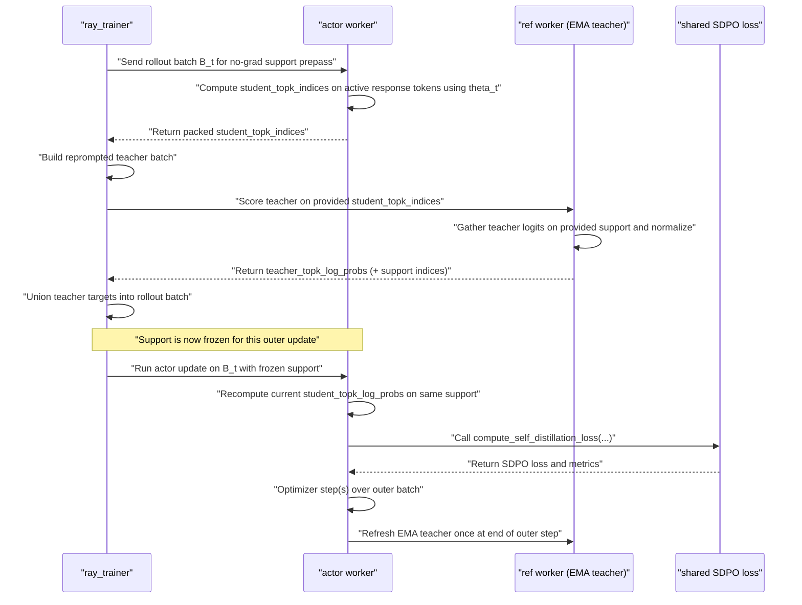

# Megatron SDPO Implementation Review

**Date:** 2026-03-16
**Updated:** 2026-03-18
**Branch:** `codex/sdpo-megatron-v070`
**Context:** Review of the Megatron SDPO port vs the upstream FSDP SDPO path, with focus on correctness, capability gaps, improvement opportunities, and the later collapse postmortem after full-logit trainer-ref support was implemented.

## Architecture Overview

The FSDP and Megatron SDPO paths diverge at the teacher scoring step:

```
                    ┌─────────────────────────────────────────┐
                    │  ray_trainer._maybe_build_self_         │
                    │  distillation_batch()                   │
                    │  (shared: builds teacher prompts,       │
                    │   self_distillation_mask, etc.)         │
                    └──────────────┬──────────────────────────┘
                                   │
                   ┌───────────────┴───────────────┐
                   │                               │
        teacher_scoring_mode:            teacher_scoring_mode:
           "actor_worker"                   "trainer_ref"
              (FSDP)                        (Megatron)
                   │                               │
    ┌──────────────▼──────────────┐  ┌─────────────▼──────────────┐
    │  dp_actor.update_policy()   │  │  ray_trainer._compute_self │
    │  - raw teacher_input_ids    │  │  _distillation_teacher_    │
    │    sent to actor            │  │  log_prob()                │
    │  - teacher forward pass     │  │  - calls _compute_ref_     │
    │    runs in-actor with       │  │    log_prob() on ref_      │
    │    teacher_module           │  │    policy_wg               │
    │  - can return top-k logits  │  │  - returns only per-token  │
    │  - supports full_logit_     │  │    log_probs               │
    │    distillation             │  │  - pre-computed, static    │
    └──────────────┬──────────────┘  └─────────────┬──────────────┘
                   │                               │
                   └───────────────┬───────────────┘
                                   │
                    ┌──────────────▼──────────────────────────┐
                    │  core_algos.compute_self_distillation_  │
                    │  loss()                                 │
                    │  (shared loss computation)              │
                    └─────────────────────────────────────────┘
```

## Key Files

| File | Role |
|------|------|
| `verl/workers/actor/megatron_actor.py` | Megatron actor; SDPO loss at lines 497–522 |
| `verl/workers/actor/dp_actor.py` | FSDP actor; SDPO loss at lines 819–860, EMA teacher at lines 133–156 |
| `verl/workers/megatron_workers.py` | Megatron worker; ref_module EMA update at lines 777–832 |
| `verl/trainer/ppo/ray_trainer.py` | Teacher batch building (lines 680–836), trainer_ref scoring (lines 655–678), mode branching (lines 1758–1762) |
| `verl/trainer/ppo/core_algos.py` | `compute_self_distillation_loss()` at lines 831–971 |
| `verl/workers/config/actor.py` | `SelfDistillationConfig` dataclass |
| `verl/trainer/config/sdpo_megatron_sciknoweval_chemistry_trainer.yaml` | Megatron SDPO chemistry config |
| `verl/trainer/config/sdpo_fsdp_sciknoweval_chemistry_trainer.yaml` | FSDP SDPO chemistry config (reference) |

## Clarifying Note

The most important distinction is not just "FSDP vs Megatron", but **where teacher scoring happens and what teacher information is available to the loss**.

- In the **FSDP path** (`teacher_scoring_mode=actor_worker`), the trainer builds the reprompted teacher inputs, but the actor worker performs both the student forward pass and the teacher forward pass inside `update_policy()`. That is why the actor can access richer teacher outputs such as top-k logits and use full-logit SDPO/JSD.
- In the **Megatron path** (`teacher_scoring_mode=trainer_ref`), the trainer builds the reprompted teacher inputs and immediately calls the ref worker to compute `teacher_log_probs` before the actor update begins. By the time the Megatron actor sees the batch, it has only per-token teacher log-probs, not full teacher distributions.

This is why the current Megatron implementation is a **token-level reverse-KL approximation** of SDPO rather than the paper's **top-k JSD/full-logit distillation** setup:

- FSDP/original SDPO can compare teacher and student **distributions** at each token position.
- Megatron currently compares only the **sampled token log-prob** at each position.

That capability gap is the main correctness difference today. It is more important than most config mismatches because it changes the actual training signal, not just its scale or presentation.

There is also a valid teacher-staleness concern in the Megatron design, but it should be interpreted carefully:

- In Megatron, `teacher_log_probs` are computed once in the trainer and reused by the actor for that update step.
- This becomes a real issue if `ppo_epochs > 1`, because the student can change across repeated optimization passes while the teacher targets stay fixed.
- Under the current configs, `ppo_epochs` is still `1`, so this is a **real architectural limitation but not the main active bug** in today's runs.

One more correction that matters when reading the rest of this document: the code already guards against using the SDPO EMA teacher as a KL reference at the same time. `main_ppo.py` rejects SDPO when `use_kl_loss` or `use_kl_in_reward` is enabled, so the "dual-purpose ref module" concern is a limitation to keep in mind for future extensions, not a silent bug in the current launches.

## Historical Issues

The issue list below reflects the pre-fix review state from March 16, before the trainer-ref full-logit path was fully debugged. It remains useful historical context, but several points below are no longer the exact current-branch status after the March 18 fixes and postmortem.

### Issue 1 (Major): `full_logit_distillation` not supported — forces weaker reverse KL

The Megatron actor explicitly blocks full-logit distillation:

```python
# megatron_actor.py:505-508
if self_distillation_cfg.full_logit_distillation:
    raise NotImplementedError(
        "Megatron SDPO on v0.7.0 supports token-level distillation only. "
        "Set actor.self_distillation.full_logit_distillation=False."
    )
```

This forces `alpha: 1.0` (pure reverse KL), because the shared loss function enforces:

```python
# core_algos.py:910
assert self_distillation_config.alpha == 1.0, "Only reverse KL is supported for non-full-logit distillation"
```

**Impact:** The token-level reverse KL loss is:

```python
log_ratio = student_log_probs - teacher_log_probs
per_token_loss = log_ratio.detach() * student_log_probs
```

This uses a single scalar (the sampled-token log-prob) per position. The FSDP path with `full_logit_distillation: true` and `distillation_topk: 100` compares the top-100 token distribution at each position via JSD (`alpha: 0.5`), giving a much richer gradient signal. Reverse KL is also mode-seeking (can collapse to a single teacher mode), while JSD is symmetric and more numerically stable.

**Root cause:** The `_compute_self_distillation_teacher_log_prob` method in `ray_trainer.py` (line 655) calls `_compute_ref_log_prob`, which only returns a single `ref_log_prob` per token. The Megatron ref worker's `compute_ref_log_prob` method (`megatron_workers.py:887-897`) calls `ref_policy.compute_log_prob`, which in turn uses `compute_logprobs_fn` (`megatron_actor.py:215-219`) — this only extracts `log_probs`, not full logits or top-k distributions.

**To fix:** The ref worker would need a new method (or an extension of `compute_ref_log_prob`) that returns top-k logits from the teacher forward pass, analogous to what the FSDP actor does internally in `dp_actor.py:832-843` with `return_all_logps` and `distill_topk`.

### Issue 2 (Medium): Shared `ref_module` serves dual purpose — teacher AND reference

In `megatron_workers.py:806-815`, the EMA update modifies `self.ref_module`:

```python
for ref_chunk, actor_chunk in zip(self.ref_module, self.actor_module, strict=True):
    for ref_param, actor_param in zip(ref_chunk.parameters(), actor_chunk.parameters(), strict=True):
        actor_data = actor_param.data.to(device=ref_param.device, dtype=ref_param.dtype)
        ref_param.data.mul_(1.0 - update_rate).add_(actor_data, alpha=update_rate)
```

But `ref_module` is also used by `compute_ref_log_prob` (`megatron_workers.py:887-897`) for standard reference log-prob computation (KL penalty in reward, KL loss).

Currently safe because the chemistry config has `use_kl_loss: false` and `use_kl_in_reward: false`. But if someone enables KL regularization alongside SDPO, the "reference" would no longer be a fixed reference — it would be the EMA teacher. This is semantically wrong and would silently produce incorrect KL penalties.

**To fix:** Either:
- Add a guard that prevents `use_kl_loss` or `use_kl_in_reward` when SDPO EMA is active, or
- Maintain a separate frozen ref_module for KL computation (memory-expensive), or
- Document this limitation prominently in the config.

### Issue 3 (Medium): Teacher log-probs are pre-computed and stale across PPO epochs

In the FSDP path, the teacher forward pass happens inside `update_policy()` for each micro-batch — the teacher scoring is fresh at each gradient step.

In the Megatron path, teacher log-probs are computed once in the trainer (`ray_trainer.py:1761`) **before** the actor update loop begins. They are shipped to the actor as a static tensor (`data["teacher_log_probs"]`). When `ppo_epochs > 1`, the student evolves across gradient steps but the teacher signal stays frozen.

The IS-clip (`is_clip: 2.0`) partially mitigates this by reweighting based on `student_log_probs - old_log_probs`, but there is still a fundamental staleness issue — the teacher targets don't reflect the student's current state.

**Impact:** With `ppo_epochs: 1` (the current chemistry config default inherited from the base), this is not an issue. But it becomes significant if someone increases `ppo_epochs`.

### Issue 4 (Low): Missing config parity with FSDP

The Megatron chemistry config (`sdpo_megatron_sciknoweval_chemistry_trainer.yaml`) is missing two settings that the FSDP config has:

| Setting | FSDP value | Megatron value | Default |
|---------|-----------|---------------|---------|
| `clip_ratio_high` | `0.28` | *(not set)* | `0.2` (from `ActorConfig` dataclass, `actor.py:211`) |
| `remove_thinking_from_demonstration` | `true` | *(not set)* | `false` (from `SelfDistillationConfig`) |

**`remove_thinking_from_demonstration: false`** means the teacher prompt includes the full `<think>...</think>` block from the successful sibling response. With Qwen3-8B generating ~5800-token responses, this can add thousands of tokens of reasoning trace to the teacher prompt, inflating context length and amplifying the teacher/student context mismatch.

**`clip_ratio_high: 0.2`** (vs upstream `0.28`) is a tighter PPO clip. Since SDPO bypasses the PPO clip entirely (it doesn't compute advantages), this only matters if someone switches away from SDPO mode on this config.

### Issue 5 (Low): No entropy regularization in the SDPO branch

In `megatron_actor.py:489`, `entropy_coeff` is computed but never used in the SDPO branch (lines 497–522). The vanilla/GRPO branch (lines 523+) applies it, but the SDPO branch returns only the distillation loss.

The FSDP path has the same gap — `dp_actor.py:819-860` also skips entropy regularization in the SDPO branch.

**Impact:** There is no counter-force against entropy collapse or explosion when running SDPO. The distillation loss is the sole gradient signal. This is a design choice inherited from upstream, not a Megatron-specific bug, but it contributes to the observed entropy explosion on long-response models.

### Issue 6 (Low): Diagnostic logging gap

The Megatron worker logs teacher/actor parameter drift metrics (`megatron_workers.py:817-827`):

```python
metrics["self_distillation/teacher_actor_param_rms_before_update"] = ...
metrics["self_distillation/teacher_actor_param_mean_abs_before_update"] = ...
```

This is good and unique to the Megatron path. However, the Megatron path does **not** log `self_distillation/per_token_loss_mean` or `self_distillation/student_minus_teacher_logprob_mean` at the worker level — these are computed inside `compute_self_distillation_loss` in `core_algos.py` and returned in the metrics dict, so they should flow through. Verify that these metrics actually appear in W&B for the Megatron runs.

## Summary Comparison Table

| Aspect | FSDP SDPO | Megatron SDPO | Severity |
|--------|-----------|---------------|----------|
| **Distillation type** | JSD over top-100 logits | Reverse KL on sampled token only | **Major** |
| **Alpha** | 0.5 (symmetric JSD) | 1.0 (mode-seeking reverse KL) | **Major** |
| **Teacher scoring location** | In-actor, per micro-batch | Pre-computed on ref worker, static | Medium |
| **Teacher model** | Separate `teacher_module` | Shared `ref_module` (dual-purpose) | Medium |
| **Teacher staleness** | Fresh per gradient step | Frozen across PPO epochs | Medium |
| **`clip_ratio_high`** | 0.28 | 0.2 (default) | Low |
| **`remove_thinking_from_demonstration`** | true | false (default) | Low |
| **Entropy regularization** | None in SDPO branch | None in SDPO branch | Low (same) |

## Recommended Priority

1. **Keep the now-enabled full-logit trainer-ref path numerically correct** — the biggest collapse we observed came from incorrect full-logit handling rather than from a high-level SDPO design choice.
2. **Add config parity** — set `remove_thinking_from_demonstration: true` and `clip_ratio_high: 0.28` in the Megatron config.
3. **Guard against dual-purpose ref_module** — at minimum add a warning/error when `use_kl_loss` or `use_kl_in_reward` is enabled alongside SDPO EMA.
4. **Consider adding entropy regularization** to the SDPO branch (both FSDP and Megatron).

## Proposed Real Implementation Fix: Full-Logit Megatron SDPO

Status on this branch:

- Phase 1 MVP plumbing is now implemented in code:
  - Megatron ref worker can emit `teacher_topk_indices` and `teacher_topk_log_probs`
  - `ray_trainer` can union those targets into the SDPO batch for `trainer_ref`
  - Megatron actor can consume those top-k targets with `full_logit_distillation=True`
- What remains unverified is runtime behavior on a fresh experiment run; the new path has passed local compile and YAML checks but has not yet been re-benchmarked end to end.

The practical fix is **not** to make Megatron imitate the FSDP worker layout exactly. For very large models, especially the intended 700B direction, the scalable design is:

- keep `teacher_scoring_mode=trainer_ref`
- keep the EMA teacher refresh at the **outer-step** level
- keep `ppo_epochs=1`
- upgrade the trainer/ref path so it caches **compressed top-k teacher targets**
- let the Megatron actor consume those top-k targets during loss computation

In other words, the right long-term target is:

- **not** "run a second full teacher forward inside the actor worker every micro-batch"
- but instead "make `trainer_ref` rich enough to support top-k full-logit SDPO"

### Why this is the right 700B-oriented design

At 700B scale, duplicating the FSDP-style `actor_worker` teacher design is expensive:

- it requires the actor-side update path to host both the student and the teacher view of the model
- it couples SDPO richness to the most memory-sensitive part of the training loop
- it makes per-micro-batch teacher recomputation much harder to scale

By contrast, the current Megatron structure already has a good systems shape for large models:

- a separate ref/teacher worker exists
- the teacher is already refreshed by EMA after each outer update
- the trainer already materializes SDPO-specific batch fields before actor optimization

So the real fix is to **upgrade the target representation**, not to throw away the architecture.

### Target design

Today the Megatron actor receives:

- `teacher_log_probs`: shape `[bs, response_len]`
- `self_distillation_mask`: shape `[bs]`

The proposed full-logit design changes that to:

- `teacher_topk_indices`: shape `[bs, response_len, k]`
- `teacher_topk_log_probs`: shape `[bs, response_len, k]`
- optionally `teacher_sampled_log_probs`: shape `[bs, response_len]` for debugging / continuity
- `self_distillation_mask`: shape `[bs]`

Then the actor computes:

- current student logits on the original response context
- `student_topk_log_probs` gathered on `teacher_topk_indices`

and calls the existing full-logit path in `compute_self_distillation_loss()` with:

- `student_topk_log_probs`
- `teacher_topk_log_probs`
- `full_logit_distillation=True`
- `distillation_topk=k`
- `alpha=0.5`

This recovers the paper-style JSD/top-k behavior without shipping full vocabulary logits through the batch.

### Proposed worker and trainer changes

#### 1. Add a new ref-worker API for distillation targets

Today `compute_ref_log_prob()` returns only:

- `ref_log_prob`

The Megatron ref path should gain a new method, conceptually:

```python
compute_ref_distillation_targets(
    data,
    distill_topk: int,
    support_mode: str = "teacher_topk",
)
```

that returns:

- `teacher_topk_indices`
- `teacher_topk_log_probs`
- optionally `teacher_log_probs` on the sampled response tokens

This should live alongside the existing `compute_ref_log_prob()` path rather than overloading KL/reference code paths.

#### 2. Extend the Megatron policy forward path

The Megatron actor/ref policy needs the same top-k extraction interface that the FSDP actor already has:

- optional `distill_topk`
- optional `topk_indices`
- optional `return_topk_indices`

The important behavior is:

- when `topk_indices is None`, compute local top-k support from the current logits
- when `topk_indices` is provided, gather logits on that support and normalize to log-probs

This is the key primitive that will let:

- the **ref worker** produce `teacher_topk_indices` and `teacher_topk_log_probs`
- the **actor worker** compute `student_topk_log_probs` on that same support

#### 3. Keep teacher support fixed per outer step

For scale and simplicity, the intended support mode should be:

- `support_mode="teacher_topk"`

That means:

1. build the teacher reprompted batch in the trainer
2. ref worker computes the teacher top-k support and teacher top-k log-probs once
3. the trainer stores those targets in the rollout batch
4. the actor update loop reuses them for that outer step

This is not bit-for-bit identical to the current FSDP student-top-k support choice, but it is:

- much closer to paper SDPO than sampled-token reverse KL
- stable to cache
- realistic for 700B scale

If we later want closer parity with FSDP, we can consider a second support mode:

- `support_mode="student_topk"`

but that would require an extra actor-side prepass or tighter actor/teacher coupling and is not the best first target for large-scale deployment.

#### 4. Wire the trainer batch fields explicitly

`ray_trainer.py` should branch on SDPO teacher mode like this:

- `actor_worker`
  - keep the current FSDP-style behavior
- `trainer_ref` + `full_logit_distillation=False`
  - keep current token-level Megatron behavior for backward compatibility
- `trainer_ref` + `full_logit_distillation=True`
  - compute and union:
    - `teacher_topk_indices`
    - `teacher_topk_log_probs`
    - `self_distillation_mask`

This keeps the migration incremental rather than requiring a flag day.

#### 5. Teach the Megatron actor to consume top-k teacher targets

`megatron_actor.py` should stop rejecting `full_logit_distillation=True` once the new batch fields exist.

Instead, when `loss_mode="sdpo"` and `full_logit_distillation=True`, it should:

1. run the student forward pass on the original response context
2. gather `student_topk_log_probs` on `teacher_topk_indices`
3. call `compute_self_distillation_loss()` with:
   - `student_topk_log_probs`
   - `teacher_topk_log_probs`
   - `self_distillation_mask`
   - `alpha=0.5`

This makes Megatron use the same shared JSD/top-k loss helper that already works in the FSDP path.

### Explicit design constraints

To keep this design coherent and safe, the following should be enforced in config or runtime guards:

1. `ppo_epochs` should remain `1` for `trainer_ref` full-logit SDPO.
   - The teacher targets are intentionally **outer-step-fixed**.
   - Reusing them across many inner epochs increases target staleness without clear benefit.

2. `use_kl_loss` and `use_kl_in_reward` should remain incompatible with SDPO EMA teacher mode.
   - This is already guarded today and should stay that way unless a separate frozen KL ref is introduced.

3. The batch payload should stay compressed.
   - Pass top-k indices and top-k log-probs only.
   - Do not pass dense vocab logits through `DataProto`.

4. Debug metrics should be preserved.
   - Keep logging:
     - `self_distillation/per_token_loss_mean`
     - `self_distillation/student_minus_teacher_logprob_mean`
     - `self_distillation/teacher_preferred_token_fraction`
   - Add new metrics if helpful:
     - `self_distillation/topk_k`
     - `self_distillation/teacher_support_entropy`
     - `self_distillation/student_teacher_topk_overlap`

### Recommended implementation phases

#### Phase 1: MVP full-logit trainer-ref path

- add ref-worker top-k target API
- add Megatron top-k gather path
- enable `full_logit_distillation=True` with `support_mode="teacher_topk"`
- allow `alpha=0.5`
- guard `ppo_epochs == 1`

This is the highest-value milestone because it closes the main algorithmic gap with the paper while preserving the scalable architecture.

#### Phase 2: Parity and debugging hardening

- add better comparison instrumentation against the FSDP path
- optionally tighten success eligibility so malformed outputs do not become SDPO teachers
- add run-time assertions that required batch fields exist for each SDPO mode

#### Phase 3: Optional closer parity with FSDP support choice

- experiment with `student_topk` or union-support variants
- evaluate whether the extra complexity is worth it relative to `teacher_topk`

This should be treated as optional research work, not the first production fix.

### Bottom line

The real Megatron fix is:

- **not** "debug reverse-KL harder"
- **not** "copy the FSDP teacher placement exactly"
- but rather:
  - keep the scalable `trainer_ref` architecture
  - add compressed top-k teacher targets
  - enable the shared full-logit JSD loss
  - make outer-step-fixed teacher targets an explicit design choice

That is the cleanest path from the current Megatron approximation to a large-scale SDPO implementation that still resembles the paper where it matters most.

## Proposed Next Design: Student-Support Top-k Under `trainer_ref`

Now that the catastrophic full-logit bug is fixed and the corrected Megatron run is stable, the remaining parity gap with FSDP is better understood as an **architecture/semantics** question rather than a correctness failure.

The main remaining semantic difference is:

- FSDP effectively distills on the **student's current top-k support**
- current Megatron `trainer_ref` distills on the **teacher's cached top-k support**

The earlier collapse investigation weakened the narrow hypothesis that "student top-1 escapes teacher support" was the root cause of the catastrophic failure. But that does **not** mean teacher-support and student-support are equivalent. For parity with the healthy FSDP path, the next design target should still be:

- keep `teacher_scoring_mode=trainer_ref`
- keep the actor student-only
- change support selection from `teacher_topk` to **student-support top-k**

### Goal

The target semantics are:

1. the actor computes `student_topk_indices` from the outer-step student state `theta_t`
2. the ref worker scores the EMA teacher on **exactly that support**
3. the actor update recomputes current student log-probs on the same frozen support
4. the shared SDPO loss runs on:
   - `student_topk_log_probs`
   - `teacher_topk_log_probs`

This preserves the scalable Megatron shape:

- no teacher colocated inside the actor
- compressed top-k targets only
- teacher still refreshed by EMA once per outer step

while moving much closer to the FSDP semantics that already work well.

### Why this is still the right next step

The raw-logit mutation bug explained the old catastrophic collapse, but it did **not** erase the remaining FSDP/Megatron difference.

Today the corrected Megatron run is stable but still trails the healthy FSDP baseline. The most plausible remaining gap is still:

- actor-local student-support scoring in FSDP
- versus cached teacher-support scoring in Megatron

Student-support top-k is attractive because it gives a more direct correction when the student begins drifting toward bad alternatives. Even if the student's top-1 token stays inside the teacher support, the broader student support can still differ in meaningful ways that the teacher-support path only sees through the tail bucket.

### Important timing nuance

This design does introduce a controlled form of staleness:

- `student_topk_indices` are computed once from the outer-step student state `theta_t`
- they are then reused during that outer update
- they are **not** recomputed after every minibatch step

So the support is:

- fresh relative to the rollout/start-of-update student
- stale relative to later inner-loop-updated student states

That is acceptable if we make the design explicit and keep:

- `ppo_epochs = 1`

This is the key compromise:

- not as fresh as FSDP actor-local scoring
- much closer to FSDP semantics than teacher-support top-k
- still realistic for very large models, including the intended 700B direction

### Proposed dataflow

The intended outer-step flow is:



The important detail is that the actor prepass is **student-only** and **no-grad**. It does not require colocating the teacher in the actor update path.

The staleness boundary is explicit:

- `student_topk_indices` are fresh with respect to `theta_t`
- once the trainer unions teacher targets back into the batch, the support is fixed for that outer update
- later minibatch updates reuse that frozen support, which is why `ppo_epochs = 1` remains important

### Proposed batch contract

The new `trainer_ref` student-support path should pass these fields through `DataProto`:

- `teacher_topk_indices`: shape `[n_active_tokens, k]` or equivalent packed representation
- `teacher_topk_log_probs`: shape `[n_active_tokens, k]`
- `student_topk_indices`: optional for debugging / invariants if not identical by construction
- `self_distillation_mask`
- existing sampled-token `teacher_log_probs` may be kept temporarily for debugging and backward compatibility

For scale, this should use an **active-token-packed** representation rather than padded `[bs, response_len, k]` tensors wherever possible.

### Proposed file-level changes

#### 1. `verl/workers/actor/megatron_actor.py`

Add a no-grad student-support prepass and a reusable support-aware scoring primitive.

Concretely:

- add a helper that can compute `student_topk_indices` on active response tokens from the current actor weights without building gradients
- extend the existing top-k/full-logit path so it can score the student on **provided support indices**, not only self-selected support
- keep the selected-token/full-logit invariant check available for this path
- continue to emit response-aligned tensors only at the final boundary where the shared SDPO loss expects them

The actor update path should then:

1. receive frozen support indices for the current outer step
2. recompute `student_topk_log_probs` on that support with the current actor state
3. call `compute_self_distillation_loss(...)`

#### 2. `verl/trainer/ppo/ray_trainer.py`

Insert a student-support preparation phase before ref-side teacher scoring.

Concretely:

- when `teacher_scoring_mode=trainer_ref` and `support_mode=student_topk`:
  1. ask the actor worker for `student_topk_indices` on the current rollout batch
  2. build / keep the reprompted teacher batch as today
  3. pass both the teacher batch and the provided support indices to the ref worker
  4. union the returned teacher targets back into the rollout batch

This should happen once per outer update before actor optimization begins.

#### 3. `verl/workers/megatron_workers.py`

Extend the ref-worker distillation API so the teacher can be scored on provided support.

Concretely:

- extend `compute_ref_distillation_targets(...)` with a support mode like:
  - `support_mode="teacher_topk"`
  - `support_mode="student_topk"`
- when student support is provided:
  - do **not** compute a new teacher-selected support
  - instead gather teacher logits on the supplied indices
  - normalize to `teacher_topk_log_probs` on that support

This keeps the teacher in the ref worker while still matching the actor-selected support.

#### 4. `verl/workers/config/actor.py` and configs

Add an explicit support-selection knob and constraints.

Recommended config additions:

- `support_mode: "teacher_topk" | "student_topk"`
- default current stable path to `"teacher_topk"` for backward compatibility
- use `"student_topk"` for the next parity-focused experiments

Recommended runtime guards:

- require `full_logit_distillation=true` for `support_mode="student_topk"`
- require `distillation_topk is not None`
- require `ppo_epochs == 1`

### Suggested implementation order

1. **Plumb support mode through config**
   - add `support_mode`
   - keep current teacher-topk path as default

2. **Add actor no-grad support extraction**
   - export packed `student_topk_indices`
   - add minimal shape/assertion logging

3. **Teach ref worker to score provided support**
   - same teacher batch as today
   - different support selection

4. **Run a same-batch diff**
   - compare corrected Megatron `teacher_topk` vs new Megatron `student_topk`
   - then compare new Megatron `student_topk` against FSDP on the same cached rollout batch

5. **Only after parity looks good, consider making `student_topk` the new recommended path**

### Risks and tradeoffs

This design is not free:

- it adds one extra actor-to-trainer/ref handoff per outer step
- support is still outer-step-frozen rather than minibatch-fresh
- packed active-token bookkeeping has to stay exact

But compared with the alternatives, it is the best compromise:

- better semantic parity than teacher-support top-k
- much cheaper than colocating teacher and student in the actor loop
- still realistic at very large scale

### Recommended decision

For the next parity iteration, the recommendation should be:

- keep the corrected full-logit `trainer_ref` path
- add `support_mode="student_topk"` under `trainer_ref`
- treat it as the primary parity experiment against FSDP

In short:

- the collapse bug is fixed
- the remaining gap is likely semantic
- **student-support top-k under `trainer_ref` is the right next design to build**

## Appendix: Teacher Refresh vs PPO Inner Loop

The term "teacher staleness" is easy to misunderstand because there are two different things involved:

1. **Teacher weights**  
   The EMA teacher parameters, call them `phi`.
2. **Teacher targets for the current batch**  
   The actual values placed in the batch and consumed by the loss, call them `y`:
   - today in Megatron: `teacher_log_probs`
   - in a future paper-like design: likely top-k teacher logits

EMA updates `phi`. It does **not** retroactively refresh `y` once `y` has already been computed and attached to a batch.

### Timeline in the current Megatron path

For one outer RL update step:

1. The trainer builds the SDPO teacher batch.
2. The trainer computes teacher targets once from the current teacher weights `phi_t`.
3. Those teacher targets are merged into the rollout batch.
4. The actor runs its update loop over that batch.
5. Only **after** the actor update loop is finished does the worker apply the EMA update:

```text
phi_{t+1} = (1 - beta) * phi_t + beta * theta_{t+1}
```

So the teacher refresh cadence today is:

- **teacher targets `y`**: once per outer update
- **EMA teacher weights `phi`**: once per outer update
- **student optimizer steps**: many times inside that same outer update

### Why `ppo_epochs` matters

The actor update loop reuses the same rollout batch multiple times according to `ppo_epochs`.

In Megatron:

- `make_minibatch_iterator()` constructs an iterator with `epochs=self.config.ppo_epochs`
- `update_policy()` takes one optimizer step per minibatch yielded from that iterator
- `_maybe_update_self_distillation_teacher()` is called only after `update_policy()` returns

So the number of student optimizer steps per teacher refresh is roughly:

```text
ceil(update_batch_size / ppo_mini_batch_size) * ppo_epochs
```

This means:

- `ppo_epochs = 1` does **not** mean "teacher refreshed after every minibatch"
- it means "one pass over the outer rollout batch before teacher refresh"

If the outer batch is larger than `ppo_mini_batch_size`, there are already multiple student optimizer steps before the teacher is refreshed.

### Concrete example

Suppose:

- rollout batch contains `256` sequences
- `ppo_mini_batch_size = 32`
- `ppo_epochs = 1`

Then the student already takes about:

```text
256 / 32 = 8
```

optimizer steps before one EMA teacher update.

If `ppo_epochs = 4`, that becomes about:

```text
8 * 4 = 32
```

student optimizer steps before the teacher is refreshed.

### What "staleness" means here

The concern is **not** that EMA is broken or that the teacher never changes.

The concern is that the cached teacher targets `y_t` were computed before the inner update loop began, and then reused while the student changes across minibatch steps.

So there are two different notions of lag:

- **Cross-step teacher lag**  
  EMA addresses this by keeping the teacher close to the student across outer steps.
- **Within-step target lag**  
  EMA does **not** address this, because the cached teacher targets for the current batch stay fixed until the next outer step.

### Is this a bug?

Not necessarily.

For large-scale training, it is perfectly reasonable to define the teacher as **fixed per outer rollout batch**:

- compute teacher targets once
- update the student on that batch
- refresh the teacher once at the end

That is a coherent design, and for very large models it may be the most practical one.

The key design choice is to make that explicit:

- if we want a **fixed teacher per outer step**, the current cadence is acceptable
- if we ever want a **fresher teacher inside the inner loop**, then the current `trainer_ref` architecture becomes limiting

### Implication for 700B-scale design

At very large scale, the most likely practical design is:

- one EMA teacher refresh per outer rollout batch
- fixed teacher targets for that outer batch
- compressed teacher targets (e.g. top-k logits) rather than full dense vocab tensors
- `ppo_epochs = 1` or otherwise a clearly documented "teacher fixed per outer step" policy

That would keep the design scalable while making the target-refresh semantics explicit.

## Appendix: Distillation Target Types

This note clarifies three related but different SDPO target styles:

1. **Sampled-token distillation**
2. **Paper-style top-k distillation**
3. **Dense full-vocab distillation**

These names describe **what teacher information is compared against the student at each response position**.

### First: what `bs` means

In tensor shapes like:

- `[bs, response_len]`
- `[bs, response_len, k]`

`bs` means **batch size**: the number of sampled response sequences in the current minibatch.

It does **not** mean:

- number of prompts in the whole dataset
- number of tokens
- number of successful groups

Example:

- `train_batch_size = 32`
- `rollout.n = 8`

Then one rollout collection step produces about:

```text
32 * 8 = 256
```

sampled responses.

If the actor update then uses:

- `ppo_mini_batch_size = 32`

the actor sees minibatches with roughly:

- `bs = 32`

at a time.

So a tensor of shape `[bs, response_len]` means:

- for each sampled sequence in the minibatch
- for each response token position in that sequence
- store one scalar

### 1. Sampled-token distillation

This is what the original Megatron SDPO port was doing.

Tensor shapes:

- `student_log_probs`: `[bs, response_len]`
- `teacher_log_probs`: `[bs, response_len]`

Interpretation:

- for each sampled sequence
- for each response token position
- compare only the log-prob assigned to the **actual token the student generated at that position**

So "one token" does **not** mean:

- one token for the whole rollout

It means:

- one token **per response position**

Concrete example:

If the student response has 200 tokens, sampled-token distillation uses 200 comparisons per sample:

- position 1: compare teacher vs student on the token the student produced at position 1
- position 2: same
- ...
- position 200: same

What it does **not** use:

- the teacher's belief over alternative tokens at that position

So if at one position the student generated `B`, the old Megatron path only compares:

- `log p_student(B)`
- `log p_teacher(B)`

It does **not** compare the teacher's broader distribution such as:

- `B = 0.70`
- `A = 0.20`
- `C = 0.08`
- `D = 0.02`

That is why sampled-token distillation is much thinner than the paper-style path.

### 2. Paper-style top-k distillation

This is what the FSDP/original-style SDPO implementation uses in practice for the Section 3 setup.

Typical settings:

- `full_logit_distillation = true`
- `distillation_topk = 100`
- `alpha = 0.5`

Tensor shapes:

- `teacher_topk_indices`: `[bs, response_len, k]`
- `teacher_topk_log_probs`: `[bs, response_len, k]`
- `student_topk_log_probs`: `[bs, response_len, k]`

Interpretation:

- for each sampled sequence
- for each response token position
- keep the teacher's top-`k` candidate tokens and their normalized log-probs
- compare the student and teacher as **distributions over those `k` tokens**

This is still "full-logit distillation" in the practical SDPO sense because the loss is distributional rather than sampled-token-only.

It is **not** dense full-vocabulary distillation, because only a compressed top-`k` support is carried forward.

Why this is much richer than sampled-token distillation:

- it tells the student not only "how much did teacher like the sampled token?"
- but also "what other tokens did teacher prefer at this position?"

This is the main reason the paper-style path is much closer to JSD-like distribution matching.

### 3. Dense full-vocab distillation

This is the most literal form of full-logit distillation.

Tensor shapes:

- `teacher_all_log_probs`: `[bs, response_len, vocab_size]`
- `student_all_log_probs`: `[bs, response_len, vocab_size]`

Interpretation:

- for each sampled sequence
- for each response token position
- compare the full teacher and student next-token distributions over the whole vocabulary

This is the mathematically richest target, but it is the most expensive by far:

- memory
- communication
- batch payload size
- compute pressure

For very large models, especially the intended 700B direction, this is usually not the practical target representation to cache and move through the batch.

### Relationship between the three

From weakest to richest teacher signal:

1. sampled-token distillation
2. top-k distillation
3. dense full-vocab distillation

From cheapest to most expensive:

1. sampled-token distillation
2. top-k distillation
3. dense full-vocab distillation

So the current design direction for Megatron is:

- move from **sampled-token**
- to **paper-style top-k**
- without trying to cache dense full-vocabulary tensors

### Why top-k is the intended Megatron target

For this port, top-k is the right compromise:

- much richer than sampled-token distillation
- much closer to the paper/FSDP behavior
- still realistic to cache as batch fields
- much more scalable than dense full-vocab teacher targets

That is why the proposed full-logit Megatron fix is based on:

- `teacher_topk_indices`
- `teacher_topk_log_probs`

rather than full dense vocabulary logits.

## Appendix: Collapse Bug Postmortem

This appendix records the actual collapsing issues we hit while bringing Megatron full-logit SDPO up to parity with the healthy Qwen Physics FSDP baseline, and the implementation fixes that resolved them.

### Symptom pattern before the real fix

The broken Megatron full-logit runs had a very consistent failure signature:

- early training looked plausible for a few steps
- then `response_length/mean` exploded into the multi-thousand-token range
- `response_length/clip_ratio` rose toward `1.0`
- `success_group_fraction` and `reprompt_sample_fraction` collapsed
- `empty_target_batch` approached `1.0`
- validation fell to near-zero or exactly zero

This originally looked like an SDPO behavioral problem, but the final root cause was lower-level and implementation-specific.

### Root cause: full-logit SDPO was reading mutated logits

The main correctness bug was in `verl/workers/actor/megatron_actor.py`.

Megatron's selected-token log-prob path uses `vocab_parallel_log_probs_from_logits(...)`. Under the hood, Megatron-LM's vocab-parallel cross entropy mutates shard logits in place:

- subtract max
- exponentiate
- normalize

The Megatron SDPO code was then reusing those same shard logits for the gathered full-logit/top-k path. That meant the two branches were no longer reading the same distribution:

- selected-token log-probs came from one effective tensor state
- top-k/full-logit SDPO targets came from another

That broke the SDPO distribution math badly enough to destabilize training.

The key invariant that exposed this bug was:

- compare the selected-token log-prob from `vocab_parallel_log_probs_from_logits(...)`
- against the same selected-token log-prob reconstructed from gathered `full_logits.log_softmax(...)`

Before the fix, the mismatch was catastrophic:

- `self_distillation/selected_logprob_from_full_abs_diff_mean ~= 10.8`

After the fix, it dropped to numerical noise:

- `~= 5e-07`

### Correct implementation fix

The correct fix is now in `verl/workers/actor/megatron_actor.py:991-1001`.

Implementation details:

1. Detect when the same forward pass needs both:
   - selected-token log-probs
   - gathered full-logit/top-k SDPO targets
2. Clone the shard logits before calling the selected-token log-prob path if top-k/full-logit SDPO is active.
3. Use the preserved raw shard logits for:
   - `gather_from_tensor_model_parallel_region(logits)`
   - top-k extraction
   - gathered full-logit probability reconstruction

In other words, the fix is:

- **do not** gather logits after the in-place cross-entropy mutation
- **do** preserve raw logits for the SDPO full-logit path

This was the fix that removed the immediate collapse regime.

### Secondary correctness fixes that were also needed

These were real implementation bugs, but they were not the main cause of the catastrophic collapse:

1. Deterministic demonstration selection in `verl/trainer/ppo/ray_trainer.py:765-771`
   - successful sibling choice previously depended on batch order
   - after batch balancing, FSDP and Megatron could choose different demonstrations
   - fixed by sorting successful candidates deterministically by score, then length, then text

2. Response-mask fallback in `verl/workers/actor/megatron_actor.py:910-913`
   - if `response_mask` is absent, rebuild it from `attention_mask[:, -response_length:]`

3. Label-mask off-by-one fix in `verl/workers/actor/megatron_actor.py:916-920`
   - make `label_mask` a true one-token-left shift of `response_mask`
   - this removed the short-response `r+1` target bug

4. Packed-vs-response alignment fixes in `verl/workers/actor/megatron_actor.py:1077-1093`
   - ensure response-aligned teacher top-k tensors line up with active packed logits

5. Metric reducer robustness in `verl/utils/metric/utils.py:23-50`
   - debugging tensors and short sequences now reduce safely to scalars
   - this did not change training behavior, but it prevented debug instrumentation from crashing logging

### What hypotheses were weakened by the fix

Several earlier hypotheses were only partially right, or became much less important after the raw-logit fix:

- **Student escaped teacher top-k support**
  - weakened as the main collapse explanation
  - may still matter for residual FSDP-vs-Megatron quality gaps, but it was not the catastrophic bug

- **Megatron was just behaviorally unstable on this task**
  - weakened
  - once the full-logit path was corrected, Megatron stopped entering the old early-collapse regime

- **The collapse was mainly a reward-format issue**
  - weakened
  - reward-format brittleness can still hurt quality, but it did not explain the old implementation-level failure

### Post-fix status

After the raw-logit fix:

- the 20-step Megatron smoke run completed cleanly
- no response-length explosion occurred
- no SDPO target-starvation collapse occurred
- the invariant stayed numerically tight through the full smoke run

The later full corrected Megatron run on Qwen Physics also stayed healthy deep into training, which is strong evidence that:

- the old immediate collapse was implementation-driven
- the current remaining FSDP-vs-Megatron gap is now an architectural/performance question, not a catastrophic correctness failure
