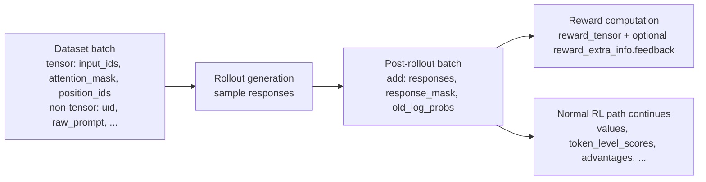
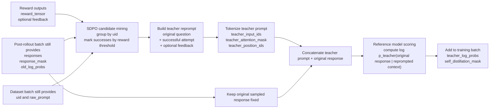
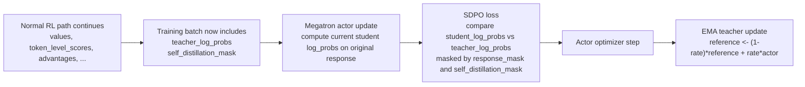
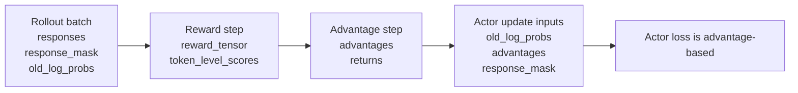
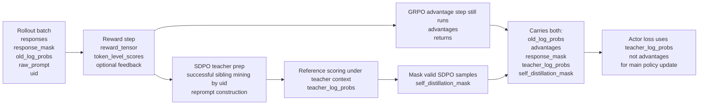
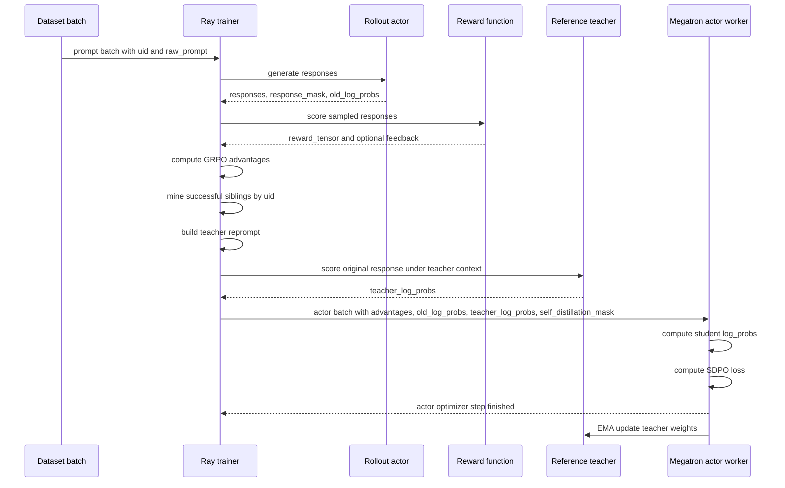

# SDPO in `verl v0.7.0`: Main Idea, Port Structure, and Experiment Guide

Last updated: 2026-03-13

## Why this note exists

This file is meant to be a working guide for:

- understanding the paper-level idea behind SDPO,
- seeing how that idea was mapped onto `verl v0.7.0`,
- identifying the main code seams for follow-up experiments.

It replaces the earlier "handoff only" framing. The goal is not just to record what changed, but to make the implementation easy to reason about and easy to modify.

## One-paragraph summary

The SDPO port keeps the normal `verl` rollout and update loop, but changes how the actor is supervised. During training, the trainer finds successful trajectories within each prompt group, turns those successes and optional feedback into a reprompted teacher context, uses the reference model as the teacher to score the original sampled response under that improved context, and then updates the actor with a self-distillation loss instead of the usual PPO policy loss. After the actor update, the teacher is refreshed with EMA.

## Repo, branch, and target setup

- Clean repo to continue from: `/Users/zhoutong/code/verl`
- Active branch: `codex/sdpo-megatron-v070`
- Target base version: `verl v0.7.0`
- Intended training path: Megatron
- Intended launcher style: Arrakis / SkyPilot

Why `v0.7.0` matters:

- The Arrakis launcher that matters clones upstream `verl`
- It explicitly checks out `v0.7.0`
- It launches the Megatron trainer path, not the FSDP path

So the relevant target is:

- `verl v0.7.0`
- Megatron workers
- Arrakis-style launch flow

## Paper-level mental model

The paper idea is:

1. Keep the normal RL or RLVR loop.
2. Let rollout and reward identify which attempts are successful.
3. Convert successful attempts into a stronger teacher context.
4. Ask a teacher model what it thinks about the student's actual response under that stronger context.
5. Update the student toward the teacher.
6. Keep the teacher close to the student with a slow-moving update rule such as EMA.

The important point is that SDPO is not a full training-loop replacement. It is a modification to the actor target inside an otherwise familiar rollout, reward, advantage, and optimize pipeline.

## What stays the same, and what changes

What stays the same:

- prompt batching
- rollout generation
- reward computation
- value computation and advantage plumbing
- Megatron optimization structure
- distributed trainer orchestration

What changes:

- a new `sdpo` actor loss mode
- trainer-side mining of successful sibling trajectories
- construction of reprompted teacher inputs
- reference-model scoring of the original response under teacher context
- actor loss swapped from PPO policy loss to self-distillation loss
- EMA update from actor to teacher after optimization

## What the teacher actually is in this port

The shortest implementation summary is:

- GRPO by itself does not require a reference model.
- GRPO only uses a reference policy when KL regularization is enabled.
- SDPO needs a teacher, so this port reuses the existing reference-policy slot as that teacher.
- So SDPO does not add a brand new third model type. It repurposes `ref_module` from "KL baseline" into "EMA teacher."

In practice, that means:

- when `loss_mode: sdpo`, the trainer forces the `ActorRolloutRef` worker path so both actor and ref are available,
- SDPO forbids combining this teacher path with KL regularization on `v0.7.0`,
- actor and teacher both start from the same `model.path`,
- the teacher is then updated with EMA after each actor step,
- the teacher is used only for scoring the sampled response under reprompted teacher context.

This is a different role from a standard KL reference policy:

- KL ref policy: usually frozen, used to measure divergence from the actor
- SDPO teacher in this port: moving, used to produce `teacher_log_probs` for distillation

Memory and lifecycle notes:

- the teacher exists as `ref_module` inside the Megatron worker,
- it may stay on GPU, or be offloaded to CPU depending on ref offload settings,
- it is loaded back to GPU when computing teacher log-probs or applying EMA.

Checkpointing note:

- as implemented today, the Megatron checkpoint manager is wired to the actor checkpoint path,
- the EMA teacher does not appear to be separately saved and restored as its own checkpoint artifact,
- on startup or resume, the teacher is rebuilt from `model.path` and then continues tracking the actor via EMA.

So if you are asking "did SDPO introduce a separate persistent teacher model?", the practical answer is:

- separate at runtime: yes
- separate model class: no
- separately checkpointed today: no
- always resident on GPU: no
  
Relevant files:

- `verl/trainer/main_ppo.py`
- `verl/workers/megatron_workers.py`
- `verl/trainer/ppo/ray_trainer.py`

## End-to-end data flow

Phase 1a: rollout and reward



Phase 1b: build SDPO teacher targets



Phase 2: actor update and teacher refresh



## GRPO vs SDPO-on-GRPO: batch fields

Regular GRPO:



SDPO port:



Key reading:

- In regular GRPO, `advantages` are the direct actor-training target.
- In this SDPO port, `advantages` are still computed because the outer trainer loop is still GRPO-shaped.
- But the SDPO actor-loss branch uses `teacher_log_probs` plus `self_distillation_mask` as the main supervision signal.
- So the final training batch contains both GRPO-style fields and SDPO-specific fields, even though the actor update is driven by the SDPO target when `loss_mode: sdpo`.

## Field-level walkthrough with annotation

### 1. Start with the normal batch

The trainer starts from the same sort of prompt batch that `verl` would normally use. The key SDPO requirement is that `raw_prompt` is preserved in the non-tensor batch so the trainer can later rebuild a teacher prompt with the original user-facing text still intact.

Relevant code:

- `verl/trainer/ppo/ray_trainer.py`
- `_get_gen_batch(...)`

Important fields at this stage:

- `input_ids`
- `attention_mask`
- `position_ids`
- `uid`
- `raw_prompt`

### 2. Rollout generation is unchanged

The actor still samples responses in the normal way. After rollout, the batch contains the sampled response tokens and the usual policy bookkeeping.

Important fields added by the normal rollout path:

- `responses`
- `response_mask`
- `old_log_probs`

This is important conceptually: SDPO does not change how exploration happens. It changes how the actor later learns from what was explored.

### 3. Reward does two jobs now

Reward still scores the rollout for RL. In addition, reward can provide optional text feedback through `reward_extra_info["feedback"]`, which can be reused as part of the teacher reprompt.

Relevant helper:

- `_collect_feedback(...)`

Important outputs:

- `reward_tensor`
- optional `reward_extra_info["feedback"]`

### 4. Success mining happens within each prompt group

The trainer groups samples by `uid` and marks a sample as successful if its sequence-level reward sum crosses `success_reward_threshold`.

Relevant helper:

- `_collect_solutions_by_uid(...)`

Mental model:

- `uid` identifies different rollouts of the same underlying prompt
- SDPO looks for successful siblings within that group

This is the main point where "RL discovered a good trajectory" gets turned into "we now have candidate teacher material."

### 5. A successful trajectory becomes a teacher-side demonstration

For each sample, the trainer tries to pick a successful response from the same `uid` group. If `dont_reprompt_on_self_success` is enabled, a sample cannot use its own answer as the demonstration and instead looks for another successful sibling.

Relevant helper:

- `_get_solution(...)`

Optional preprocessing:

- `_remove_thinking_trace(...)`

This means the current port supports experiments like:

- self-success allowed vs forbidden
- include `<think>` traces vs strip them

### 6. The reprompt is the core SDPO transformation

The trainer reconstructs a new teacher prompt from:

- the original user question,
- an optional "Correct solution" section containing a successful previous attempt,
- an optional environment feedback section.

This is where the paper idea shows up most clearly in code. The model is not simply trained on a reward-weighted sample. It is trained against a teacher that sees a better context than the student saw during sampling.

Relevant method:

- `_maybe_build_self_distillation_batch(...)`

Important config knobs:

- `reprompt_template`
- `solution_template`
- `feedback_template`
- `include_environment_feedback`
- `environment_feedback_only_without_solution`
- `max_reprompt_len`
- `reprompt_truncation`

### 7. The teacher does not generate a fresh response in this port

This is one of the most important implementation choices.

The trainer tokenizes the teacher prompt, then concatenates it with the original sampled response tokens:

- `teacher_input_ids = [teacher_prompt_tokens ; original_response_tokens]`

The teacher then scores the original response under the reprompted context. It does not decode a new answer here.

Important derived fields:

- `teacher_input_ids`
- `teacher_attention_mask`
- `teacher_position_ids`

Why this matters:

- it keeps the implementation lightweight,
- it lets the port reuse the original rollout sample,
- it means the supervision target is "teacher preference over the student's actual response under better context," not "teacher-generated replacement output."

### 8. The reference model acts as the teacher

The reprompted batch is passed through the reference-policy scoring path. The result is stored as `teacher_log_probs`.

Relevant method:

- `_compute_self_distillation_teacher_log_prob(...)`

Important output fields:

- `teacher_log_probs`
- `self_distillation_mask`

Shape intuition:

- `teacher_log_probs`: `[batch_size, response_length]`
- `self_distillation_mask`: `[batch_size]`

### 9. Masking prevents fake supervision

Not every sample will have a usable successful sibling or usable feedback. The trainer therefore builds `self_distillation_mask`, which is `1` only for samples with a valid distillation target.

This keeps the actor from receiving fake SDPO supervision on samples where there is no teacher information.

### 10. The SDPO fields are merged back into the normal training batch

After the teacher log-probs are computed, the trainer unions them back into the normal batch before the actor update.

Relevant seam in the main training loop:

- `ray_trainer.py`
- call to `_maybe_build_self_distillation_batch(...)`
- call to `_compute_self_distillation_teacher_log_prob(...)`

This is why the port feels lightweight. The overall loop is still recognizably `verl`; the batch just carries a few extra fields when `loss_mode == "sdpo"`.

### 11. The actor now consumes teacher targets instead of PPO advantages

In the Megatron actor, SDPO mode selects these extra fields:

- `teacher_log_probs`
- `self_distillation_mask`

Then it swaps out the usual policy loss computation and calls `compute_self_distillation_loss(...)`.

Relevant file:

- `verl/workers/actor/megatron_actor.py`

Important conceptual point:

- `advantages` are still present in the batch because the rest of the trainer pipeline is still RL-shaped
- but the SDPO actor-loss branch itself uses teacher supervision rather than the usual PPO policy-gradient target

### 12. The current Megatron port is token-level distillation only

The general loss helper supports a full-logit distillation branch, but the Megatron port on `v0.7.0` currently uses only the token-level path.

Current config expectation:

- `full_logit_distillation: false`
- `alpha: 1.0`

In the non-full-logit branch, the key objects are:

- `student_log_probs`
- `teacher_log_probs`
- `response_mask`
- optional `self_distillation_mask`

Relevant file:

- `verl/trainer/ppo/core_algos.py`

### 13. The teacher is refreshed with EMA after the actor step

After the actor optimizer step finishes, the Megatron worker updates the reference model toward the actor model with EMA.

Relevant file:

- `verl/workers/megatron_workers.py`

Current supported teacher regularization mode:

- `teacher_regularization: ema`

This means the teacher is not frozen forever, and it is not fully tied to the actor either. It is a lagged teacher.

## High-level code changes by concept

### Config surface

File:

- `verl/workers/config/actor.py`

What changed:

- added `SelfDistillationConfig`
- added `actor.self_distillation`
- allowed `policy_loss.loss_mode: sdpo`
- exposed reprompt, feedback, and teacher-update knobs

Why it matters:

- this is the top-level switch that makes SDPO visible to both trainer and actor

### Trainer wiring

File:

- `verl/trainer/main_ppo.py`

What changed:

- if `loss_mode == "sdpo"`, require a colocated reference worker
- reject shared-ref KL regularization combinations
- reject the new worker path for this port

Why it matters:

- the implementation needs a reference model available as a teacher

### Trainer-side teacher batch construction

File:

- `verl/trainer/ppo/ray_trainer.py`

What changed:

- preserve `raw_prompt`
- collect optional feedback
- find successful samples by `uid`
- build teacher reprompts
- tokenize reprompts
- compute teacher log-probs on the original response
- add `teacher_log_probs` and `self_distillation_mask` to the batch

Why it matters:

- this is where the paper idea is converted into actual batch fields

### Distillation loss

File:

- `verl/trainer/ppo/core_algos.py`

What changed:

- added `compute_self_distillation_loss(...)`

Why it matters:

- this is the actual objective used by the actor in SDPO mode

### Megatron actor integration

File:

- `verl/workers/actor/megatron_actor.py`

What changed:

- pass through `teacher_log_probs`
- pass through `self_distillation_mask`
- route actor loss into SDPO loss branch
- reject full-logit SDPO on this Megatron port

Why it matters:

- this is the actual training-time replacement of PPO policy loss with SDPO loss

### Teacher maintenance

File:

- `verl/workers/megatron_workers.py`

What changed:

- update the reference model with EMA after actor optimization

Why it matters:

- this keeps the teacher synchronized in the intended SDPO style

### Config and launcher example

Files:

- `verl/trainer/config/sdpo_megatron_trainer.yaml`
- `examples/skypilot/verl-sdpo-megatron-llama33-4nodes.yaml`

What changed:

- added a dedicated Megatron trainer config for SDPO
- added a SkyPilot launcher shaped like the Arrakis setup

Why it matters:

- this makes the port easier to launch and easier to compare against a baseline

## What is generic SDPO logic vs Megatron-specific work

The easiest way to separate the changes is:

- generic SDPO logic defines what the trainer should do conceptually,
- Megatron-specific work makes that logic actually train correctly on the Megatron worker path in `verl v0.7.0`.

| Area | Generic SDPO change | Megatron-specific change | Main files |
| --- | --- | --- | --- |
| Config surface | Add `loss_mode: sdpo` and self-distillation config knobs | Provide a Megatron trainer config that explicitly selects token-level SDPO and compatible settings | `verl/workers/config/actor.py`, `verl/trainer/config/sdpo_megatron_trainer.yaml` |
| Trainer orchestration | Require a teacher path when SDPO is enabled | Force the Megatron `ActorRolloutRef` path on `v0.7.0` and reject unsupported worker/KL combinations | `verl/trainer/main_ppo.py` |
| Success mining and reprompting | Group by `uid`, find successful siblings, build reprompted teacher inputs, collect optional feedback | No special Megatron math here; this part is mostly backend-agnostic trainer logic | `verl/trainer/ppo/ray_trainer.py` |
| Teacher target construction | Score the original sampled response under the teacher context and attach `teacher_log_probs` plus `self_distillation_mask` to the batch | Reuse the Megatron reference-policy scoring path to produce those teacher log-probs | `verl/trainer/ppo/ray_trainer.py` |
| Actor loss | Replace normal PPO or GRPO actor target with self-distillation loss in SDPO mode | Teach the Megatron actor to ingest `teacher_log_probs` and `self_distillation_mask` during minibatch updates | `verl/workers/actor/megatron_actor.py`, `verl/trainer/ppo/core_algos.py` |
| Distillation objective | Define `compute_self_distillation_loss(...)` | Limit Megatron `v0.7.0` to token-level SDPO and reject full-logit mode for now | `verl/trainer/ppo/core_algos.py`, `verl/workers/actor/megatron_actor.py` |
| Teacher model lifecycle | Keep a separate teacher that tracks the student slowly | Build and maintain both `actor_module` and `ref_module` inside the Megatron worker and update the ref model with EMA after actor optimization | `verl/workers/megatron_workers.py` |
| Memory and offload behavior | Not part of the paper idea directly | Load and offload the Megatron reference model around EMA when ref-param offload is enabled | `verl/workers/megatron_workers.py` |

Short mental model:

- `ray_trainer.py` contains most of the paper idea.
- `megatron_actor.py` contains the Megatron training-time loss swap.
- `megatron_workers.py` contains the Megatron teacher lifecycle and EMA update.

## Important design choices in this port

### The teacher scores the student's existing response

The current code does not ask the teacher to generate a new completion. Instead, it scores the sampled student response under a better prompt.

This is a good fit if you want:

- a lightweight port,
- low disruption to the rollout pipeline,
- direct reuse of existing sampled trajectories.

This is not the same as:

- generating a new teacher answer and distilling against that answer token-by-token.

If your experiment needs fresh teacher decoding, that would be a new design branch.

### Success is defined by reward threshold inside each `uid` group

The current port depends heavily on:

- prompt grouping by `uid`
- reward sum thresholding

If your experiment changes the notion of success, the first place to look is the trainer logic that builds `success_by_uid`.

### Feedback is optional and reward-function dependent

The richer feedback path only activates if:

- the config enables it,
- the reward function emits a `feedback` field in extra reward info.

This means the current code already has a useful hook for richer experiment variants, but the reward side must cooperate.

### Distillation is sparse

Only samples with a usable solution or usable feedback get SDPO supervision. Everyone else is masked out by `self_distillation_mask`.

That is a deliberate design choice, not an accident.

## Current implementation boundaries

This port is intentionally scoped.

Current boundaries:

- Megatron only
- `verl v0.7.0` legacy worker path only
- token-level SDPO only
- full-logit SDPO is not implemented in the Megatron path
- `actor.use_kl_loss` must be `false`
- `algorithm.use_kl_in_reward` must be `false`
- EMA is the only implemented teacher regularization mode in Megatron
- richer feedback only works if the reward function returns `feedback`

Validation status:

- Python AST parse checks were run on modified Python files
- YAML parse checks were run on the new config files
- no full training run has been executed yet

## Best levers for follow-up experiments

If you want to experiment, these are the highest-value seams.

### 1. Change how successful demonstrations are selected

Primary code:

- `_collect_solutions_by_uid(...)`
- `_get_solution(...)`

Good experiments:

- change `success_reward_threshold`
- choose best success instead of first success
- sample among successful siblings
- allow or forbid self-success reuse

### 2. Change what goes into the teacher reprompt

Primary code:

- `_maybe_build_self_distillation_batch(...)`
- `SelfDistillationConfig`

Good experiments:

- change `reprompt_template`
- include more or less of the original conversation
- include feedback only when no solution exists
- change prompt truncation strategy
- add structured rubric text

### 3. Change whether reasoning traces are used as demonstrations

Primary code:

- `_remove_thinking_trace(...)`
- `remove_thinking_from_demonstration`

Good experiments:

- keep full successful solutions with reasoning
- strip `<think>` traces before constructing the teacher prompt

### 4. Change the teacher objective

Primary code:

- `compute_self_distillation_loss(...)`

Good experiments:

- alter token-level objective details
- change or remove importance-weight clipping
- implement full-logit distillation for Megatron
- compare reverse-KL-like behavior against other choices

### 5. Change teacher dynamics

Primary code:

- `_maybe_update_self_distillation_teacher(...)`

Good experiments:

- sweep `teacher_update_rate`
- freeze the teacher
- update teacher less frequently
- try trust-region style teacher behavior if you want to extend the port

### 6. Change how feedback enters the pipeline

Primary code:

- `_collect_feedback(...)`
- reward function implementation used by training

Good experiments:

- emit richer reward feedback
- use feedback alongside successful solutions
- use feedback only when no successful sibling exists

### 7. Compare against a baseline cleanly

Primary code and config:

- `sdpo_megatron_trainer.yaml`
- baseline Megatron PPO or GRPO config

Good experiments:

- same launcher, same reward function, same dataset
- switch only `loss_mode`
- compare SDPO against GRPO under identical rollout setup

## Suggested low-risk first experiments

If the goal is to build intuition before large training runs, these are good first ablations:

1. Vary `success_reward_threshold`.
2. Toggle `dont_reprompt_on_self_success`.
3. Toggle `remove_thinking_from_demonstration`.
4. Enable reward feedback and compare with solution-only reprompts.
5. Sweep `teacher_update_rate`.
6. Compare SDPO config against a GRPO baseline with the same launch environment.

## Small public smoke test

For a first end-to-end check, a practical public setup is:

- model: `Qwen/Qwen2.5-0.5B-Instruct`
- dataset: `openai/gsm8k`
- backend: Megatron
- hardware target: 1 GPU

Files added for this smoke path:

- `verl/trainer/config/grpo_megatron_smoke_trainer.yaml`
- `verl/trainer/config/sdpo_megatron_smoke_trainer.yaml`
- `examples/sdpo_trainer/run_qwen2_5_0_5b_gsm8k_megatron_smoke.sh`
- `examples/skypilot/verl-sdpo-megatron-smoke-qwen05b.yaml`

What this smoke setup does:

- uses GSM8K preprocessed into the standard `verl` parquet format,
- limits training to a tiny subset with `train_max_samples` and `val_max_samples`,
- caps the run at `trainer.total_training_steps: 3`,
- keeps the model small and the rollout count low enough for quick validation.

Prepare the public dataset:

```bash
python3 examples/data_preprocess/gsm8k.py --local_save_dir "$HOME/data/gsm8k"
```

Run the GRPO baseline:

```bash
VARIANT=grpo bash examples/sdpo_trainer/run_qwen2_5_0_5b_gsm8k_megatron_smoke.sh
```

Run the SDPO variant:

```bash
VARIANT=sdpo bash examples/sdpo_trainer/run_qwen2_5_0_5b_gsm8k_megatron_smoke.sh
```

SkyPilot version of the same smoke test:

```bash
sky launch -c verl-sdpo-smoke examples/skypilot/verl-sdpo-megatron-smoke-qwen05b.yaml -y
```

Notes on the SkyPilot smoke path:

- it clones `https://github.com/zhoutong-hai/verl.git` on branch `codex/sdpo-megatron-v070`,
- it installs the same Megatron-Bridge stack used by the larger Llama 3.3 launcher,
- it now points to pre-staged assets on `model-eval` under `/hai/zhoutong/sdpo_megatron_smoke_qwen25_05b/`,
- it defaults to `VARIANT=sdpo`,
- you can switch to the GRPO baseline by editing `envs.VARIANT` in the SkyPilot YAML.

Useful things to confirm in the logs:

- the GRPO run finishes cleanly on the tiny setup,
- the SDPO run enters `loss_mode == "sdpo"`,
- `self_distillation/reprompt_sample_fraction` is above zero,
- `self_distillation/empty_target_batch` is usually false,
- no unexpected NaNs appear in `teacher_log_probs` or actor loss.

If GPU memory is tight, the first knob to lower is:

- `actor_rollout_ref.rollout.gpu_memory_utilization`

## Files changed in the current port

Core code changes:

- `verl/workers/config/actor.py`
- `verl/trainer/main_ppo.py`
- `verl/trainer/ppo/core_algos.py`
- `verl/trainer/ppo/ray_trainer.py`
- `verl/workers/actor/megatron_actor.py`
- `verl/workers/megatron_workers.py`

Config and launcher files:

- `verl/trainer/config/sdpo_megatron_trainer.yaml`
- `examples/skypilot/verl-sdpo-megatron-llama33-4nodes.yaml`

Documentation tweak:

- `examples/skypilot/README.md`

## Current continuation point

- repo: `/Users/zhoutong/code/verl`
- branch: `codex/sdpo-megatron-v070`

Original scratch port repo used during development:

- repo: `/Users/zhoutong/code/SDPO/verl-v070-sdpo-port`
- branch: `codex/sdpo-megatron-v070`

## External reference

Paper:

- `https://arxiv.org/pdf/2601.20802`

## Short version

The shortest correct summary of this port is:

> Keep the normal `verl` Megatron RL loop. Identify successful trajectories in each prompt group. Rebuild a teacher prompt from the original question plus a successful attempt and optional feedback. Use the reference model to score the original sampled response under that teacher context. Train the actor against those teacher token probabilities instead of the normal PPO policy loss. Then update the teacher with EMA.

## Appendix: Sequence-diagram view



## Appendix: SkyPilot Launch Chain and Env-Propagation Gotcha

For the SkyPilot experiment launchers in this branch, the execution path is:

```text
sky launch
  -> examples/skypilot/*.yaml
  -> SkyPilot setup: clone repo, install verl, verify model/data
  -> SkyPilot run: start custom Ray, log into W&B, export shell env
  -> examples/sdpo_trainer/*.sh
  -> python3 -m verl.trainer.main_ppo --config-name ...
  -> Ray TaskRunner / worker processes
```

The important practical distinction is:

- SkyPilot `envs:` are reliably available in the top-level `setup:` and `run:` shell.
- They are not always reliable deep inside Ray worker processes when a Hydra config later resolves `${oc.env:...}`.

That means a value can exist in the launcher shell but still disappear by the time a Ray worker evaluates the config.

This came up in the OLMo Physics runs when validation samples were supposed to be dumped via:

```yaml
trainer:
  validation_data_dir: ${oc.env:VALIDATION_DATA_DIR,null}
```

What happened:

- the top-level `python3 -m verl.trainer.main_ppo` process had `VALIDATION_DATA_DIR`
- validation definitely ran
- but the Ray `TaskRunner` that executed `_validate()` did not have that env var
- so `trainer.validation_data_dir` effectively resolved to `null` inside the worker
- result: validation ran, but `_dump_generations()` never wrote `*.jsonl`

The safer pattern for values that must survive into Ray workers is:

- prefer a literal Hydra CLI override over a late `${oc.env:...}` lookup

Example:

```bash
python3 -m verl.trainer.main_ppo \
  --config-name "$CONFIG_NAME" \
  trainer.experiment_name="$EXP_NAME" \
  trainer.validation_data_dir="$VALIDATION_DATA_DIR"
```

Rule of thumb:

- if a value is only needed in shell, env vars are fine
- if a value must be consumed later inside Ray actors/workers, prefer a literal config value or CLI override

This is especially relevant for:

- dump paths like `validation_data_dir` or `rollout_data_dir`
- experiment metadata that must be visible to remote workers
- any path or flag that is resolved lazily by Hydra after Ray has spawned worker processes

Executing an intermediate `*.sh` wrapper from the SkyPilot YAML adds another risk layer too.

Why that is risky:

- it creates one more boundary where env vars are transformed, defaulted, or dropped
- shell fallback logic can quietly diverge from the actual Hydra config
- values may exist in the wrapper shell but not in downstream Ray workers
- debugging gets harder because the real runtime config is split across:
  - SkyPilot YAML
  - shell exports and conditionals
  - trainer YAML
  - Hydra CLI overrides
- reproducibility gets worse because the exact effective config is harder to reconstruct from logs

In other words, the full path becomes:

```text
SkyPilot YAML
  -> shell env
  -> bash wrapper logic
  -> Hydra config + CLI overrides
  -> Ray worker runtime
```

and each hop can mutate the final behavior.

Safer patterns:

- best for reproducibility:
  - call `python3 -m verl.trainer.main_ppo ...` directly from the SkyPilot YAML
  - keep important values as explicit Hydra CLI overrides
- acceptable for convenience:
  - keep a small wrapper script, but make it as thin and deterministic as possible
  - avoid shell-only defaults for values that matter inside Ray workers
  - print the final resolved command before execution
- avoid:
  - relying on `${oc.env:...}` for critical runtime values unless you know the Ray workers will inherit them

For quick iteration, a wrapper script is still useful. But for longer-running experiments and especially large-scale launches, fewer configuration layers is usually the safer design.
