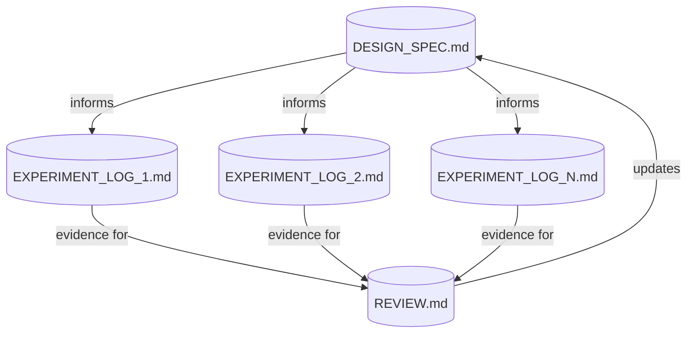
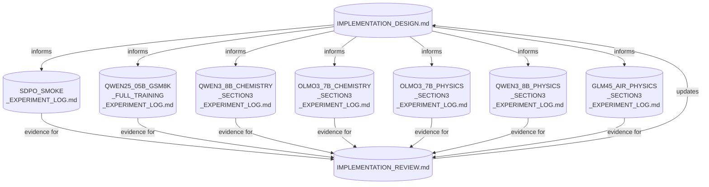

# Agent Experiment Workflow

## Document Workflow



`.md` docs are the main **human-readable shared memory** between human and agent across sessions. They are not the only persistent state: the current branch head, checked-in launcher/config files, and committed code changes are also part of the experiment state. Each doc is produced or updated through **chat sessions** (design discussions, experiment sessions, review discussions) which are ephemeral, so any decision that future sessions must rely on should be captured either in docs or in committed code/config.

| Artifact | Owner | Produced By | Contains |
|----------|-------|-------------|----------|
| **Design Spec** | Human + Agent | Design discussions | Implementation plan, current status, known boundaries |
| **Experiment Log** | Agent (human reviews) | Experiment sessions | Per-run setup, issues, results, open questions |
| **Review Doc** | Human + Agent | Review discussions | Cross-experiment comparison, failure modes, design critique |

In practice, these artifacts work together with:

- checked-in launcher/config files, which are the canonical executable setup
- the current branch head, which is the canonical code state
- live cluster metadata, which must be recorded in experiment logs while a run is active

## Role Boundaries

```
Human responsibilities:
  - bring the research idea and paper context
  - make design decisions when tradeoffs exist
  - provide task instructions for each experiment
  - decide when to escalate to the next experiment stage
  - decide when enough evidence exists to trigger a review
  - validate review conclusions before design changes

Agent responsibilities:
  - draft and maintain design spec based on human direction
  - execute experiments: setup, launch, debug, log
  - write structured experiment logs during/after runs
  - draft review docs comparing evidence against design
  - update design spec after human-approved review
  - flag when observations contradict the current design

Neither should do alone:
  - design pivots (agent proposes, human decides)
  - declaring parity or success (agent presents evidence, human judges)
  - choosing the next experiment (agent suggests, human picks)
```

## Experiment Progression: Same Experiment vs New Experiment

One thing to keep explicit is the difference between:

- continuing the **same experiment**
- starting a **new experiment**

Same experiment:

- same core hypothesis and experiment intent
- same experiment family or variant
- same success criterion
- failures are handled by diagnose -> fix -> relaunch -> monitor

Examples:

- fixing shape mismatches, OOMs, env propagation bugs, or launcher issues
- tightening sequence budgets for the same bring-up run
- relaunching the same GLM-Air SDPO configuration after a runtime fix

New experiment:

- a new hypothesis is being tested
- a materially different algorithmic variant is being compared
- the model family, dataset family, or task intent changes

Examples:

- switching from SDPO to GRPO
- switching from `teacher_topk` to `student_topk`
- moving from Qwen Physics to GLM-Air Physics
- moving from benchmark tasks to an internal dataset

Operational rule:

- agents should continue autonomously within the **same experiment** until the run is healthy or clearly blocked
- agents should only pause for human direction when the next step is a real **new experiment** or a high-risk decision

## Experiment Log Template

Each experiment log should follow this structure so the agent can produce them consistently and the human can review them quickly:

```markdown
# [Model] [Task] Experiment Log

## Goal
One sentence: what this experiment is trying to validate.

## Setup
- Model, dataset, backend, hardware
- Config file path and key overrides
- Exact launcher/config path
- Exact launch command or commit
- Active branch / commit

## Live Run Identity
- Cluster name / job id / pod or head-node target
- W&B URL
- Local log path
- Validation dump path
- Current run status (active, failed, relaunched, completed)

## Run Timeline
Chronological entries:
- Step N: observation
- Issue: description -> Fix: what was changed

## Results
Key metrics table at matched steps.

## Conclusions
- What was validated or invalidated
- Open questions for next experiment

## Failure Modes Encountered
Bulleted list (feeds into the review).
```

Notes:

- `Live Run Identity` is essential for long-running multi-node jobs. Another agent should be able to resume from the log without rediscovering where the run lives.
- If a run is relaunched multiple times, the log should preserve that history instead of overwriting it.
- Exact metric names should be written consistently, e.g. `val-core/sciknoweval/acc/mean@16`, not a mixture of `mean@16`, `best@16`, and `maj@16` without context.

## When to Trigger Each Phase

```
Trigger a REVIEW when:
  - a catastrophic failure was root-caused
  - results contradict the design spec
  - moving to a materially larger model or new architecture
  - a parity claim becomes plausible or gets meaningfully weakened
  - 3+ experiments have completed since last review and no earlier trigger already fired

Trigger a DESIGN UPDATE when:
  - review identifies a correctness bug in the design
  - a key assumption was invalidated by experiments
  - a new capability was added (e.g. student_topk support)

Trigger a NEW EXPERIMENT when:
  - the previous experiment completed or is clearly blocked
  - a review produced a new hypothesis to test
  - the design spec was updated and needs validation
```

Practical rule:

- reviews are **event-driven first**, count-driven second
- if a decisive bug, parity result, or design contradiction appears, review immediately rather than waiting for a quota of experiments

## Example: SDPO Megatron Port

This pattern was developed during the SDPO Megatron port in this repo. Here is how the artifacts map to actual files:



The experiments followed this progression:

| Experiment | What it validated | Key outcome |
|------------|-------------------|-------------|
| **Smoke test** (Qwen2.5-0.5B, GSM8K) | End-to-end Megatron SDPO plumbing | Fixed colocated actor+ref init, config normalization |
| **Full training** (Qwen2.5-0.5B, GSM8K) | Algorithm works beyond 3 steps | Setup completed, pending launch |
| **Chemistry** (Qwen3-8B) | Paper task reproduction | SDPO collapsed to zero targets; identified long-response dilution |
| **Chemistry** (OLMo-3-7B) | Paper's original model choice | Blocked by vLLM runtime (needs v0.11.0+) |
| **Physics** (OLMo-3-7B) | Easier task with same model | Same vLLM block; useful for validation dump debugging |
| **Physics** (Qwen3-8B) | Clean Megatron vs FSDP comparison | Found and fixed the critical in-place logit mutation bug; Megatron reached near-parity |
| **Physics** (GLM-4.5-Air, SDPO teacher_topk) | Scale to large MoE model on 4 nodes | Cleared multi-node bring-up, MoE, memory, and env propagation issues; reached stable SDPO training |
| **Physics** (GLM-4.5-Air, GRPO) | Baseline comparison at the same scale | No-KL GRPO collapsed early; KL delayed collapse substantially but did not prevent late max-length degeneration |
| **Physics** (GLM-4.5-Air, SDPO student_topk) | Large-model parity follow-up | Started after the stable teacher-topk baseline; used to compare support-construction semantics on the same stack |

The review doc (`IMPLEMENTATION_REVIEW.md`) was triggered after the Physics Qwen3-8B experiments revealed the logit mutation bug. It captured the postmortem, updated the design understanding, and proposed the `student_topk` support mode — which then fed back into `IMPLEMENTATION_DESIGN.md`.

## Recommended Agent Behavior

If another agent is asked to continue this style of work, the expected behavior is:

1. Read the design spec, review doc, and the current experiment log for the active model/task.
2. Confirm the checked-in launcher/config matches the intended run.
3. Resume from the live run identity recorded in the experiment log.
4. If the run fails:
   - diagnose the concrete failure
   - patch the fix
   - relaunch the same experiment
   - update the experiment log
5. Continue this loop until:
   - the run is healthy, or
   - the experiment is clearly blocked, or
   - the next action would start a truly new experiment

This is the main autonomy boundary:

- do not stop after every failure just to ask what to try next
- do stop when the next action changes the experiment intent
