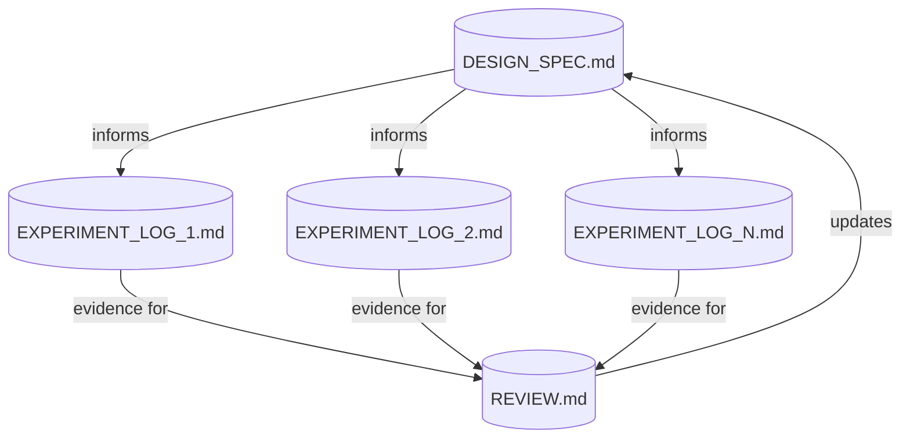
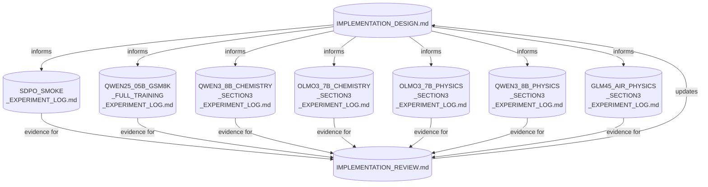

# Research Automation Workflow: Working with Coding Agents

## Document Workflow



`.md` docs are the **persistent shared memory** between human and agent across sessions. Each doc is produced or updated through **chat sessions** (design discussions, experiment sessions, review discussions) which are ephemeral — decisions made in chat must be captured in docs to survive across conversations.

| Artifact | Owner | Produced By | Contains |
|----------|-------|-------------|----------|
| **Design Spec** | Human + Agent | Design discussions | Implementation plan, current status, known boundaries |
| **Experiment Log** | Agent (human reviews) | Experiment sessions | Per-run setup, issues, results, open questions |
| **Review Doc** | Human + Agent | Review discussions | Cross-experiment comparison, failure modes, design critique |

## Role Boundaries

```
Human responsibilities:
  - bring the research idea and paper context
  - make design decisions when tradeoffs exist
  - provide task instructions for each experiment
  - decide when to escalate to the next experiment stage
  - decide when enough evidence exists to trigger a review
  - validate review conclusions before design changes

Agent responsibilities:
  - draft and maintain design spec based on human direction
  - execute experiments: setup, launch, debug, log
  - write structured experiment logs during/after runs
  - draft review docs comparing evidence against design
  - update design spec after human-approved review
  - flag when observations contradict the current design

Neither should do alone:
  - design pivots (agent proposes, human decides)
  - declaring parity or success (agent presents evidence, human judges)
  - choosing the next experiment (agent suggests, human picks)
```

## Experiment Log Template

Each experiment log should follow this structure so the agent can produce them consistently and the human can review them quickly:

```markdown
# [Model] [Task] Experiment Log

## Goal
One sentence: what this experiment is trying to validate.

## Setup
- Model, dataset, backend, hardware
- Config file path and key overrides
- Exact launch command or commit

## Run Timeline
Chronological entries:
- Step N: observation
- Issue: description -> Fix: what was changed

## Results
Key metrics table at matched steps.

## Conclusions
- What was validated or invalidated
- Open questions for next experiment

## Failure Modes Encountered
Bulleted list (feeds into the review).
```

## When to Trigger Each Phase

```
Trigger a REVIEW when:
  - 3+ experiments have completed since last review
  - a catastrophic failure was root-caused
  - results contradict the design spec
  - moving to a materially larger model or new architecture

Trigger a DESIGN UPDATE when:
  - review identifies a correctness bug in the design
  - a key assumption was invalidated by experiments
  - a new capability was added (e.g. student_topk support)

Trigger a NEW EXPERIMENT when:
  - the previous experiment completed or is clearly blocked
  - a review produced a new hypothesis to test
  - the design spec was updated and needs validation
```

## Example: SDPO Megatron Port

This pattern was developed during the SDPO Megatron port in this repo. Here is how the artifacts map to actual files:



The experiments followed this progression:

| Experiment | What it validated | Key outcome |
|------------|-------------------|-------------|
| **Smoke test** (Qwen2.5-0.5B, GSM8K) | End-to-end Megatron SDPO plumbing | Fixed colocated actor+ref init, config normalization |
| **Full training** (Qwen2.5-0.5B, GSM8K) | Algorithm works beyond 3 steps | Setup completed, pending launch |
| **Chemistry** (Qwen3-8B) | Paper task reproduction | SDPO collapsed to zero targets; identified long-response dilution |
| **Chemistry** (OLMo-3-7B) | Paper's original model choice | Blocked by vLLM runtime (needs v0.11.0+) |
| **Physics** (OLMo-3-7B) | Easier task with same model | Same vLLM block; useful for validation dump debugging |
| **Physics** (Qwen3-8B) | Clean Megatron vs FSDP comparison | Found and fixed the critical in-place logit mutation bug; Megatron reached near-parity |
| **Physics** (GLM-4.5-Air) | Scale to large MoE model | Cascading MoE constraints (MTP, CP, memory); in progress |

The review doc (`IMPLEMENTATION_REVIEW.md`) was triggered after the Physics Qwen3-8B experiments revealed the logit mutation bug. It captured the postmortem, updated the design understanding, and proposed the `student_topk` support mode — which then fed back into `IMPLEMENTATION_DESIGN.md`.
